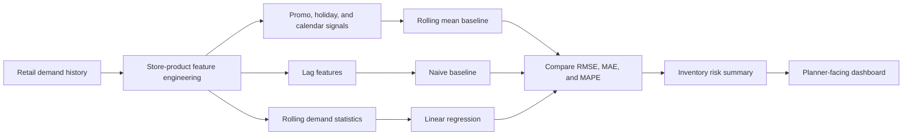

# Demand Forecasting and Inventory Decision Support

[](https://github.com/Ikteder/Demand-Forecasting-and-Inventory-Decision-Support/actions/workflows/python-check.yml)

<p align="center">
  
</p>

<p align="center">
  
  
  
  
</p>

A retail forecasting project that estimates store-product demand, compares forecasting approaches, and translates forecast error into inventory planning signals.

## Project Snapshot

| Area | Result |
| --- | --- |
| Best model on the bundled demo run | `LinearRegression` |
| Lowest RMSE | `3.10` |
| Lowest MAE | `2.47` |
| Highest store inventory exposure | `S2` |
| Highest product inventory exposure | `P2` |
| Chronological evaluation window | `35 days` |

## Visual Walkthrough

<p align="center">
  
  
</p>
<p align="center">
  
  
</p>
<p align="center">
  
  
</p>
<p align="center">
  
</p>

## Overview

The workflow is built around three practical questions:

- Which model is most reliable for short-horizon store-product forecasting?
- Which stores and products are hardest to forecast when variability increases?
- Where is the largest overstock and understock exposure if planners act on the forecast?

The repository includes a deterministic synthetic retail dataset so the full pipeline can run immediately and later be swapped for Rossmann, Favorita, Walmart, or M5. The bundled data contains 2,190 daily observations across two stores and three products from January 1 through December 30, 2024.

## Workflow



## Key Findings

- Linear regression produced the strongest overall performance on the bundled synthetic data, with RMSE `3.10` and MAE `2.47` on the final 35 dates.
- These results demonstrate pipeline behavior, not expected performance on real retail operations.
- Store **S2** and product **P2** carried the largest simulated inventory exposure in the sample run.
- Forecast-horizon values are illustrative planning scenarios rather than separately trained horizon models.

## Repository Guide

| Path | Purpose |
| --- | --- |
| `src/` | Reusable code for loading data, engineering features, training models, and writing outputs |
| `app/streamlit_app.py` | Lightweight dashboard for metrics and figures |
| `data/demo/` | Bundled demo dataset |
| `reports/` | Metrics tables and chart assets used in the README |
| `sql/` | Business-facing rollup queries |
| `tests/` | Small checks for feature engineering helpers |
| `scripts/generate_demo_data.py` | Reproduce the bundled synthetic dataset with seed `20260409` |
| `docs/` | Dataset, experiment, model, decision, and working notes |

## Quick Start

```bash
pip install -r requirements.txt
python scripts/generate_demo_data.py  # optional: reproduce the bundled data
python -m pytest -q
python -m src.forecasting
streamlit run app/streamlit_app.py
```

## Verification

The automated workflow runs the test suite and the complete forecasting pipeline on Python 3.11. The current verified local run produced three passing tests and regenerated the checked-in reports from the deterministic dataset.

## Limitations

- The bundled data is synthetic and intentionally simple; it cannot validate real-world demand accuracy or inventory savings.
- The linear model and rolling baselines are demonstrations, not production forecasting recommendations.
- Inventory exposure is a simulated error-cost proxy and excludes lead times, service levels, carrying cost, lost sales, and operational constraints.
- The horizon reliability table is an illustrative scenario table rather than metrics from separately trained horizon-specific models.
- A real deployment needs leakage-controlled backtesting over multiple origins and evaluation across stores, products, seasonal regimes, and stockout behavior.

## License

Released under the [MIT License](LICENSE).

## Extensions

- Swap the demo dataset for Rossmann, Favorita, Walmart, or M5.
- Add XGBoost or LightGBM for a stronger boosted baseline.
- Split forecast quality by promotion regime, holiday periods, and stockout events.
- Add quantile forecasts for uncertainty-aware inventory planning.
- Add reorder-point and service-level policy recommendations.
