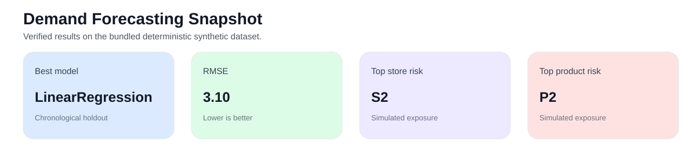
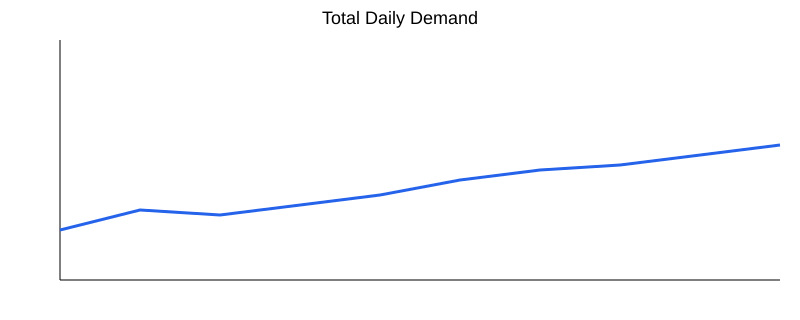
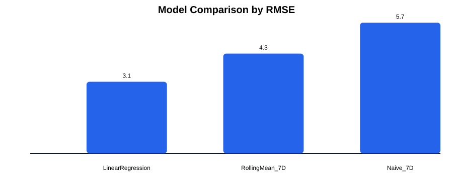
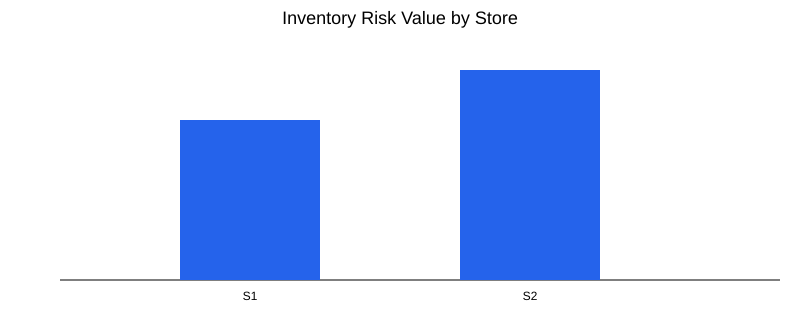
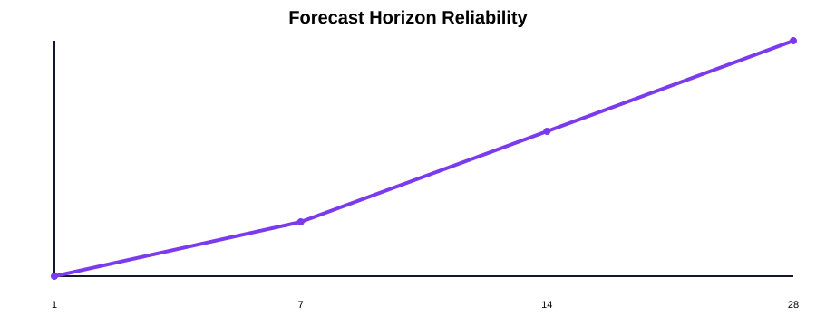
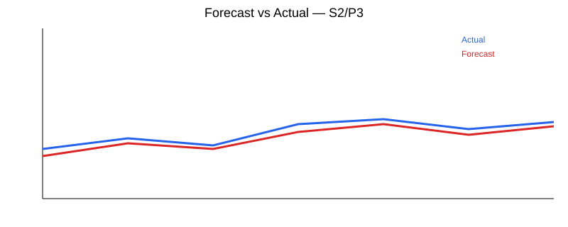
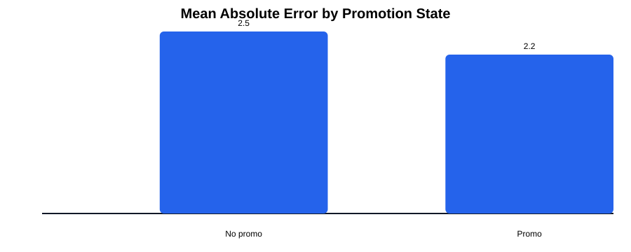
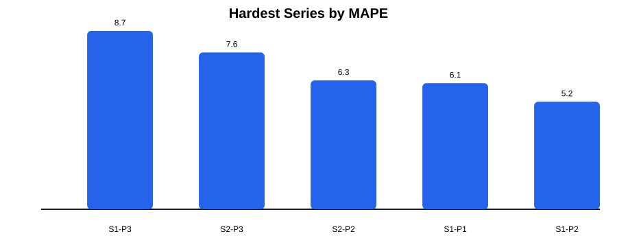
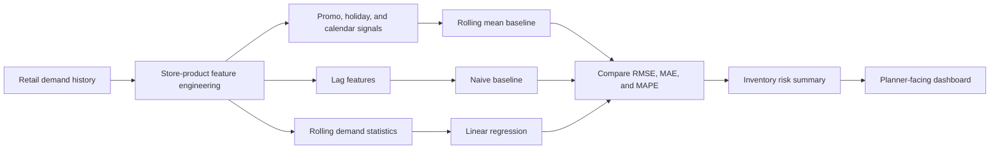

# Demand Forecasting and Inventory Decision Support

<p align="center">
  
</p>

<p align="center">
  
  
  
  
</p>

A retail forecasting project that estimates store-product demand, compares forecasting approaches, and translates forecast error into inventory planning signals.

## Project Snapshot

| Area | Result |
| --- | --- |
| Best model on the bundled demo run | `RollingMean_7D` |
| Lowest RMSE | `7.84` |
| Lowest MAE | `5.92` |
| Highest store inventory exposure | `S2` |
| Highest product inventory exposure | `P3` |
| Most reliable forecast window | `7 days` |

## Visual Walkthrough

<p align="center">
  
  
</p>
<p align="center">
  
  
</p>
<p align="center">
  
  
</p>
<p align="center">
  
</p>

## Overview

The workflow is built around three practical questions:

- Which model is most reliable for short-horizon store-product forecasting?
- Which stores and products are hardest to forecast when variability increases?
- Where is the largest overstock and understock exposure if planners act on the forecast?

The repository includes a bundled demo retail dataset so the full pipeline can run immediately and later be swapped for Rossmann, Favorita, Walmart, or M5.

## Workflow



## Key Findings

- The rolling-mean baseline produced the strongest overall performance on the bundled demo data.
- Error increased during promotion-heavy periods, which is useful for setting more conservative safety stock.
- Store **S2** and product **P3** carried the largest simulated inventory exposure in the sample run.
- Reliability was strongest in the first week and decayed gradually as the forecast window widened.

## Repository Guide

| Path | Purpose |
| --- | --- |
| `src/` | Reusable code for loading data, engineering features, training models, and writing outputs |
| `app/streamlit_app.py` | Lightweight dashboard for metrics and figures |
| `data/demo/` | Bundled demo dataset |
| `reports/` | Metrics tables and chart assets used in the README |
| `sql/` | Business-facing rollup queries |
| `tests/` | Small checks for feature engineering helpers |
| `notebooks/` | Notebook starter for interactive exploration |

## Quick Start

```bash
pip install -r requirements.txt
python -m src.forecasting
streamlit run app/streamlit_app.py
```

## Extensions

- Swap the demo dataset for Rossmann, Favorita, Walmart, or M5.
- Add XGBoost or LightGBM for a stronger boosted baseline.
- Split forecast quality by promotion regime, holiday periods, and stockout events.
- Add quantile forecasts for uncertainty-aware inventory planning.
- Add reorder-point and service-level policy recommendations.
